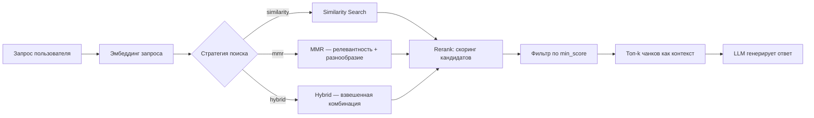

# Retrieve-Rerank-RAG


Retrieve & Rerank RAG система с поддержкой различных стратегий поиска и ранжирования.

## Как работает пайплайн



Ключевая идея: документы из векторного поиска **переоцениваются** перед отправкой в LLM — в контекст попадает не «что нашлось», а «что действительно релевантно».

## Особенности

- **Retrieve & Rerank**: Повышает релевантность за счет оценки полученных документов перед отправкой в LLM
- **Множественные стратегии поиска**:
  - Similarity Search: стандартный поиск по релевантности
  - MMR (Maximum Marginal Relevance): поиск с учетом разнообразия результатов
  - Hybrid Search: комбинированный поиск, использующий оба метода
- **Настраиваемые параметры**:
  - `lambda_param`: баланс между релевантностью и разнообразием в MMR
  - `similarity_weight`: вес для результатов similarity поиска в hybrid режиме
  - `min_score`: минимальный порог релевантности
  - `k`: количество возвращаемых результатов

## Установка

1. Клонируйте репозиторий:
```bash
git clone https://github.com/DmitriiSednev/Retrieve-Rerank-RAG.git
cd Retrieve-Rerank-RAG
```

2. Создайте виртуальное окружение и активируйте его:
```bash
python -m venv .venv
.venv\Scripts\activate  # для Windows
source .venv/bin/activate  # для Linux/Mac
```

3. Установите зависимости:
```bash
pip install -r requirements.txt
```

4. Создайте файл `.env` на основе `.env.example` и добавьте ваш API ключ:
```
OPENAI_API_KEY=your_api_key_here
```

## Использование

```python
from database import ChromaDatabase

# Инициализация базы данных
db = ChromaDatabase()

# Добавление документов
db.add_documents(documents)

# Поиск с разными стратегиями
# 1. Стандартный поиск
result = db.query("Ваш запрос", search_type="similarity")

# 2. MMR поиск
result = db.query("Ваш запрос", search_type="mmr", lambda_param=0.5)

# 3. Гибридный поиск
result = db.query(
    "Ваш запрос",
    search_type="hybrid",
    lambda_param=0.5,
    similarity_weight=0.7
)
```

## Тестирование

```bash
python -m pytest test_rag.py -v
```

## Лицензия

MIT